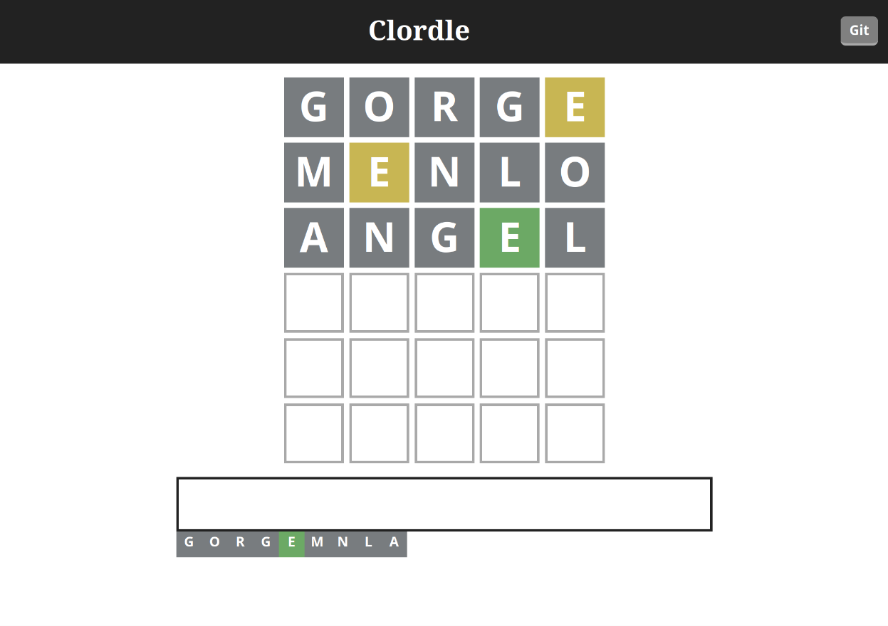
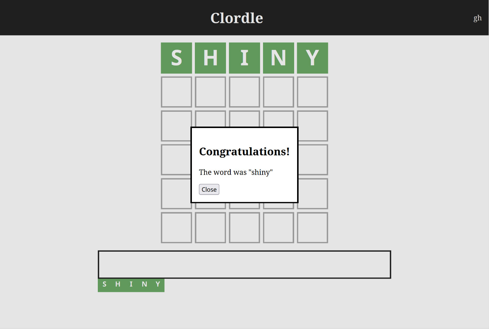
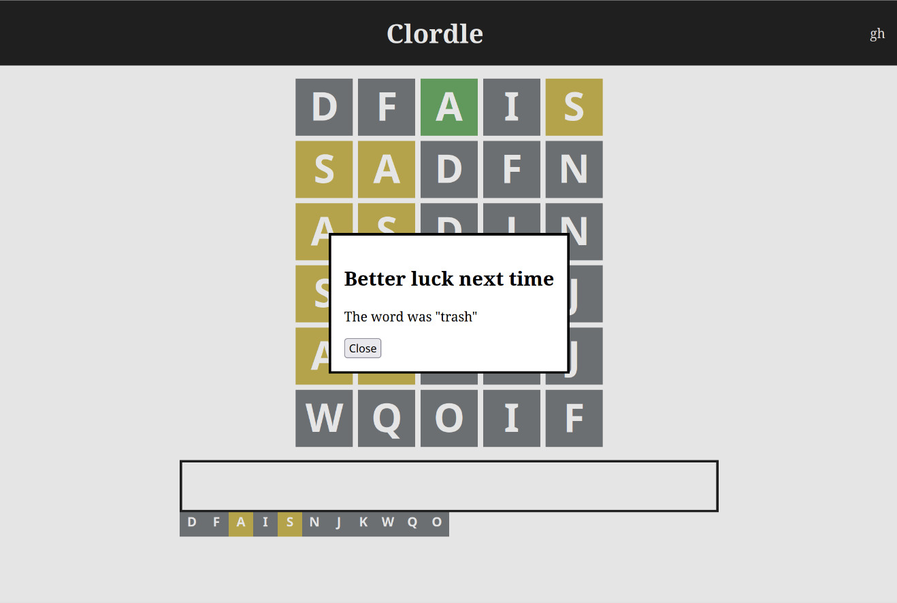

#+title: Clordle
#+author: Amy
#+date: <2025-06-19 Thu>
#+startup: inlineimages

Clordle is a clone of NYT Games' Wordle, written entirely in Clojure, with a minimal frontend written using vanilla JS and HTML.

* Building
To build the project, you first need to install [[https://clojure.org][Clojure]] and [[https://leiningen.org/#install][Leiningen]].
Then, run ~lein uberjar~ to create a uberjar inside the newly created ~dist~ directory.

* Screenshots
#+caption: A screenshot of the Clordle interface.
#+name: fig:game_sample

#+caption: A screenshot of the win dialog in Clordle.
#+name: fig:win_sample

#+caption: A screenshot of the game over dialog in Clordle.
#+name: fig:game_over_sample

* TODO Hosting Clordle
TBD.

* Api reference
** Endpoints
*** GET ~/api/handshake~
Get a padded "secret word" generated at runtime; Used to prevent cheating.
*** GET ~/api/puzzles~
Get a list of all previous puzzles, including today's puzzle, as an HTML unordered list.
*** POST ~/guess/:id~
Submit a guess for the puzzle with the given id.
The request body must contain a 5 letter word, fewer or more characters will result in an error.
Response is as follows:
    The guess consists of 5 "cells" consisting of 3 different states.
    0: Means that the character at that position is not in the word.
    1: Means that the character at that position is in the word, just not on that specific position. (Duplicates will be marked as 0)
    2: Means that the character at that position is in the word and on that specific position.
*** POST ~/giveup/:id~
Get the solution for the puzzle given its id.
The request body must contain the secret word given from the handshake endpoint.

** Sample implementation
A sample implementation on how to use the API can be found in ~resources/public/js/game.js~
